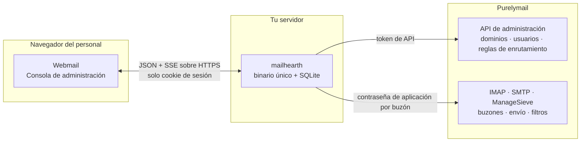

# Mailhearth

[English](README.md) · [简体中文](README.zh-CN.md) · [繁體中文](README.zh-TW.md) · [日本語](README.ja.md) · **Español**

**Mailhearth** es una plataforma de correo empresarial autoalojada para equipos
pequeños (1–50 personas): startups, empresas unipersonales, estudios y
organizaciones pequeñas. Convierte una cuenta de
[Purelymail](https://purelymail.com) en un producto de correo completo para el
equipo: una organización con miembros, roles, buzones personales y compartidos,
alias, grupos y dominios, además de un cliente de webmail rápido que el personal
usa a diario sin llegar a oír nunca la palabra «Purelymail».

Purelymail se encarga del correo: SMTP, entrega, filtrado de spam, almacenamiento,
DKIM y DMARC. Mailhearth se encarga de la organización, los permisos, la
administración y la experiencia de usuario. No se reimplementa nada que
Purelymail ya haga bien.



Las credenciales se quedan en tu servidor: el navegador nunca recibe el token de
API ni ninguna contraseña de buzón.

| Webmail | Consola de administración |
|---|---|
|  |  |
|  |  |

<sub>Generado por `node scripts/screenshot.mjs <url> <out-dir> en`, que maneja la
interfaz real contra el entorno de desarrollo.</sub>

## Qué obtienes

**Para administradores**

- Asistente de primera ejecución: crea la organización, pega un token de API de
  Purelymail e importa todos los dominios, buzones y reglas de enrutamiento
  existentes sin tocar la cuenta.
- Da de alta a las personas tal como piensas en ellas: nombre, rol, departamento,
  un buzón nuevo o existente, acceso a buzones compartidos, grupos y un enlace de
  invitación.
- Buzones compartidos (`support@`, `sales@`) en los que trabaja varias personas
  sin ver nunca una contraseña. Niveles de acceso: total / envío / lectura.
- Alias, reenvíos, direcciones catch-all y con prefijo, y direcciones de
  distribución de grupo que siguen automáticamente la pertenencia al grupo.
- Baja de un miembro en un solo paso: traspasar un buzón, convertirlo en
  compartido, conservarlo o bloquearlo, reenviar el correo nuevo, rotar todas las
  credenciales y salir de los grupos.
- Dominios con estado de DNS (MX/SPF/DKIM/DMARC) y registros DNS listos para
  copiar y pegar.
- Roles con permisos detallados, registro de auditoría y transferencia de
  propiedad.

**Para todo el mundo**

- Un cliente de webmail rápido y adaptable: carpetas, paginación, búsqueda en el
  servidor, marcas, acciones masivas, archivos adjuntos, borradores con guardado
  automático, firmas y varias identidades de envío, notificaciones de escritorio
  mediante IMAP IDLE, atajos de teclado, modo claro y oscuro, y una interfaz en
  cinco idiomas.
- Trabajo en equipo en buzones compartidos: ver quién respondió, asignar un
  mensaje, marcarlo como resuelto y dejar notas internas.
- Reglas de correo y respuestas automáticas compiladas a Sieve e instaladas en el
  servidor, de modo que funcionan aunque no haya nadie conectado.

**Postura de seguridad**

- El token de API de Purelymail y cada contraseña de aplicación de buzón se cifran
  en reposo (AES-256-GCM, con la clave derivada de una clave maestra) y nunca
  salen del servidor. Los navegadores solo guardan una cookie de sesión.
- El HTML de los mensajes se sanea en el servidor y se renderiza en un iframe
  aislado y sin scripts bajo una CSP estricta; las imágenes remotas se bloquean
  hasta que las pides; los archivos adjuntos se sirven con `nosniff` y disposición
  de descarga.
- Protección CSRF, inicio de sesión con límite de intentos, hash de contraseñas
  argon2id y rastro de auditoría.

## Requisitos

- Una cuenta de Purelymail con al menos un dominio propio y un token de API
  (portal de Purelymail → Account → API).
- Un host Linux pequeño (con 512 MB de RAM sobra; el binario en reposo ronda los
  30 MB) y un proxy inverso que termine TLS (Caddy, nginx, Traefik).

## Puesta en marcha

```bash
git clone https://github.com/yll682/Mailhearth.git && cd Mailhearth
cp .env.example .env            # define MAILHEARTH_BASE_URL con tu URL pública
docker compose up -d --build
```

Abre la URL, crea la organización, conecta Purelymail, importa y listo. Haz una
copia de seguridad del volumen `/data`: contiene la base de datos SQLite y
`master.key`.

Sin Docker, `make build` genera un binario estático `mailhearth` que incluye el
cliente web. Ejecútalo con `MAILHEARTH_DATA_DIR=/var/lib/mailhearth`.

## Pruébalo sin una cuenta de Purelymail

```bash
make dev        # o: MAILHEARTH_DEV_STACK=1 go run ./cmd/mailhearth -seed-demo
```

Esto inicia una simulación en proceso de la API de Purelymail, un servidor IMAP y
un servidor SMTP con datos de demostración. Usa el token de API `dev-token` en el
asistente y vincula `alice@acme.test` como tu buzón. No se conserva nada entre
reinicios.

## Configuración

Todo son variables de entorno; consulta [`.env.example`](.env.example). Las
únicas que normalmente defines son `MAILHEARTH_BASE_URL` y
`MAILHEARTH_TRUST_PROXY`.

## Documentación

- [Arquitectura](docs/architecture.es.md): componentes, modelo de datos y cómo
  Mailhearth traslada sus conceptos a Purelymail.
- [Seguridad](docs/security.es.md): modelo de amenazas y controles implementados.
- [Operaciones](docs/operations.es.md): copias de seguridad, actualizaciones,
  dimensionamiento y resolución de problemas.
- [Pruebas de integración](docs/integration-testing.es.md): verificar una versión
  contra una cuenta real de Purelymail.
- [Registro de cambios](CHANGELOG.es.md): qué cambió en cada versión.

## Desarrollo

```bash
make test                       # go vet + go test + tsc
make test-integration           # contra una cuenta real de Purelymail, consulta docs
cd web && npm run dev           # servidor de desarrollo Vite que redirige /api a :8080
node scripts/screenshot.mjs http://127.0.0.1:8090 out en   # maneja la interfaz
```

Go 1.27, Preact + Vite y SQLite (controlador Go puro, sin cgo). Todo se
distribuye en un solo binario.

La interfaz se ofrece en inglés, chino simplificado, chino tradicional (Taiwán),
japonés y español. Los textos están en
[`web/src/lib/i18n.ts`](web/src/lib/i18n.ts): el inglés es el origen, y un idioma
nuevo es un diccionario más una entrada en el selector de idioma.

## Licencia

MIT. El texto completo está en [LICENSE](LICENSE).
