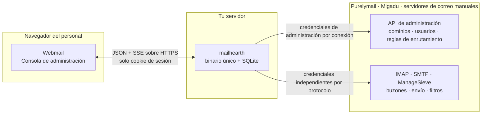
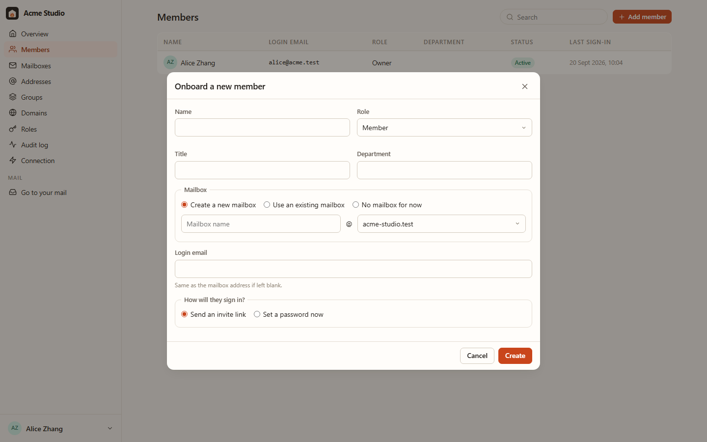

# Mailhearth

[English](README.md) · [简体中文](README.zh-CN.md) · [繁體中文](README.zh-TW.md) · [日本語](README.ja.md) · **Español**

**Mailhearth** es una plataforma de correo empresarial autoalojada para equipos
pequeños (1–50 personas): startups, empresas unipersonales, estudios y
organizaciones pequeñas. Conecta Purelymail, Migadu y buzones IMAP/SMTP configurados
manualmente con miembros, roles, buzones personales y compartidos, alias, grupos,
dominios y un cliente de webmail.

Los servidores de correo proporcionan entrega, filtrado y almacenamiento.
Mailhearth proporciona organización, permisos, administración y experiencia de usuario.
La autenticación de la API de administración y de cada protocolo se configura por separado.


```mermaid
flowchart LR
    subgraph browser["Navegador del personal"]
        SPA["Webmail<br/>Consola de administración"]
    end
    subgraph host["Tu servidor"]
        APP["mailhearth<br/>binario único + SQLite"]
    end
    subgraph pm["Purelymail · Migadu · servidores de correo manuales"]
        API["API de administración<br/>dominios · usuarios · reglas de enrutamiento"]
        MAIL["IMAP · SMTP · ManageSieve<br/>buzones · envío · filtros"]
    end

    SPA <-->|"JSON + SSE sobre HTTPS<br/>solo cookie de sesión"| APP
    APP -->|"credenciales de administración por conexión"| API
    APP -->|"credenciales independientes por protocolo"| MAIL
```

Las consultas habituales no devuelven contraseñas API ni de protocolos guardadas.
Las contraseñas nuevas para clientes externos tienen un flujo autorizado de reclamación única.

| Webmail | Consola de administración |
|---|---|
|  |  |
|  |  |

<sub>Generado por `node scripts/screenshot.mjs <url> <out-dir> en`, que maneja la
interfaz real contra el entorno de desarrollo.</sub>

## Qué obtienes

**Para administradores**

- Asistente inicial: crea la organización y las conexiones, descubre y selecciona
  recursos, configura credenciales o completa la configuración sin vincular un buzón.
  La importación solo lee recursos remotos; el acceso requiere configuración independiente.
- Da de alta a las personas tal como piensas en ellas: nombre, rol, departamento,
  un buzón nuevo o existente, acceso a buzones compartidos, grupos y un enlace de
  invitación.
- Buzones compartidos (`support@`, `sales@`) en los que trabaja varias personas
  sin ver nunca una contraseña. Niveles de acceso: total / envío / lectura.
- Alias, reenvíos, direcciones catch-all y con prefijo, y direcciones de
  distribución de grupo que siguen automáticamente la pertenencia al grupo.
- Baja con pasos persistentes: transferir o conservar buzones, actualizar grupos y
  revocar sesiones. Las credenciales siguen las capacidades del proveedor; la revocación
  externa requiere un informe del administrador registrado por separado.
- Dominios con estado de DNS (MX/SPF/DKIM/DMARC) y registros DNS listos para
  copiar y pegar.
- Roles con permisos detallados, registro de auditoría y transferencia de
  propiedad.

**Para todo el mundo**

- Un cliente de webmail rápido y adaptable: carpetas, paginación, búsqueda en el
  servidor, marcas, acciones masivas, archivos adjuntos, borradores con guardado
  automático, firmas y varias identidades de envío, notificaciones de escritorio
  mediante IMAP IDLE, atajos de teclado, modo claro y oscuro, y una interfaz en
  cinco idiomas.
- Trabajo en equipo en buzones compartidos: ver quién respondió, asignar un
  mensaje, marcarlo como resuelto y dejar notas internas.
- Reglas y respuestas automáticas en servidores con ManageSieve configurado y las
  extensiones necesarias. Los scripts existentes se conservan; sustituir el activo exige confirmación.
- Las solicitudes de envío guardan por separado SMTP y la copia en Sent. Un resultado
  desconocido no se reintenta automáticamente; reintentar la copia no repite SMTP.

**Postura de seguridad**

- Las credenciales de API y las contraseñas de protocolos se cifran con AES-256-GCM
  y claves derivadas de la clave maestra. El navegador guarda una cookie de sesión.
  Un administrador autorizado puede reclamar una nueva contraseña para clientes externos
  una sola vez y dentro de su plazo de caducidad.
- El HTML de los mensajes se sanea en el servidor y se renderiza en un iframe
  aislado y sin scripts bajo una CSP estricta; las imágenes remotas se bloquean
  hasta que las pides; los archivos adjuntos se sirven con `nosniff` y disposición
  de descarga.
- Protección CSRF, inicio de sesión con límite de intentos, hash de contraseñas
  argon2id y rastro de auditoría.

## Requisitos

- Una cuenta de Purelymail o Migadu para administrar mediante API, o un buzón existente
  con credenciales IMAP/SMTP para una conexión manual. ManageSieve es opcional.
- Un host Linux pequeño (con 512 MB de RAM sobra; el binario en reposo ronda los
  30 MB) y un proxy inverso que termine TLS (Caddy, nginx, Traefik).

## Puesta en marcha

```bash
git clone https://github.com/yll682/Mailhearth.git && cd Mailhearth
cp .env.example .env            # define MAILHEARTH_BASE_URL con tu URL pública
docker compose up -d --build
```

Abre la URL, crea la organización, configura conexiones y selecciona recursos.
Configura y verifica las credenciales de cada protocolo habilitado antes de usar el correo. Haz una
copia de seguridad del volumen `/data`: contiene la base de datos SQLite y
`master.key`.

Sin Docker, `make build` genera un binario estático `mailhearth` que incluye el
cliente web. Ejecútalo con `MAILHEARTH_DATA_DIR=/var/lib/mailhearth`.

## Usar un buzón IMAP/SMTP existente

Selecciona una conexión manual y registra la dirección completa y el hostname, port,
TLS mode, username y password de cada protocolo habilitado. IMAP y SMTP pueden usar
credenciales diferentes. Deshabilita ManageSieve si no existe. La validación TLS usa
certificados del sistema o un conjunto de certificados CA privados configurado explícitamente.

La importación de reenvíos conserva el buzón de origen, el estado de confirmación de
cada destino y las referencias remotas. Los modos sin verificar permanecen `unverified`;
la escritura de reenvíos de Migadu requiere la verificación de entrega V03.

## Configuración

Todo son variables de entorno; consulta [`.env.example`](.env.example). Las
únicas que normalmente defines son `MAILHEARTH_BASE_URL` y
`MAILHEARTH_TRUST_PROXY`.

## Documentación

- [Arquitectura](docs/architecture.es.md): componentes, modelo de datos y cómo
  Mailhearth administra conexiones, endpoint de protocolos y operaciones persistentes.
- [Seguridad](docs/security.es.md): modelo de amenazas y controles implementados.
- [Operaciones](docs/operations.es.md): copias de seguridad, actualizaciones,
  dimensionamiento y resolución de problemas.
- [Pruebas de integración](docs/integration-testing.es.md): verificar una versión
  con Purelymail, Migadu y entornos de protocolos manuales reales.
- [Registro de cambios](CHANGELOG.es.md): qué cambió en cada versión.

## Desarrollo

```bash
go test ./... -run '^$'
go test -count=1 ./... -run '^TestMultiProvider'
go vet ./...
npm --prefix web run typecheck
npm --prefix web run test
npm --prefix web run build
cd web && npm run dev           # servidor de desarrollo Vite que redirige /api a :8080
```

Go 1.27, Preact + Vite y SQLite (controlador Go puro, sin cgo). Todo se
distribuye en un solo binario.

La interfaz se ofrece en inglés, chino simplificado, chino tradicional (Taiwán),
japonés y español. Los textos están en
[`web/src/lib/i18n.ts`](web/src/lib/i18n.ts): el inglés es el origen, y un idioma
nuevo es un diccionario más una entrada en el selector de idioma.
`web/tests/i18n.test.mjs` comprueba la cobertura y los parámetros de interpolación.
La aceptación con proveedores reales sigue pendiente; las comprobaciones locales no confirman la entrega externa.

## Licencia

MIT. El texto completo está en [LICENSE](LICENSE).
