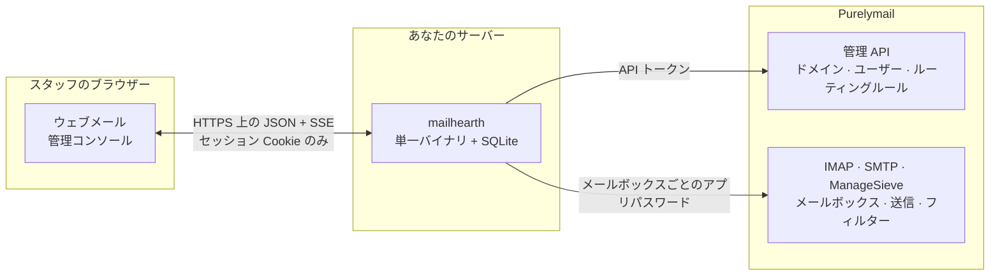

# Mailhearth

[English](README.md) · [简体中文](README.zh-CN.md) · [繁體中文](README.zh-TW.md) · **日本語** · [Español](README.es.md)

**Mailhearth** は、小規模チーム（1〜50 人）向けのセルフホスト型ビジネスメール
基盤です。スタートアップ、一人会社、スタジオ、小規模組織に適しています。1 つの
[Purelymail](https://purelymail.com) アカウントを、完全なチームメール製品に変え
ます。メンバー、ロール、個人メールボックスと共有メールボックス、エイリアス、
グループ、ドメインを備えた組織、そしてスタッフが毎日使っても「Purelymail」という
言葉を耳にすることのない高速なウェブメールクライアントです。

Purelymail がメールそのものを担当します。SMTP、配送、スパムフィルタリング、
ストレージ、DKIM、DMARC です。Mailhearth が組織、権限、管理、ユーザー体験を
担当します。Purelymail がすでに得意としている部分は、一切作り直しません。



認証情報があなたのサーバーから外に出ることはありません。ブラウザーが API
トークンやメールボックスのパスワードを受け取ることも一切ありません。

| ウェブメール | 管理コンソール |
|---|---|
|  |  |
|  |  |

<sub>`node scripts/screenshot.mjs <url> <out-dir> en` で生成しています。この
コマンドは開発スタックに対して実際の UI を操作します。</sub>

## できること

**管理者向け**

- 初回起動ウィザード：組織を作成し、Purelymail API トークンを貼り付け、既存の
  ドメイン、メールボックス、ルーティングルールをすべて取り込みます。アカウント
  には一切手を加えません。
- 人を思い浮かべるそのままの形でメンバーを追加できます。氏名、ロール、部署、
  新規または既存のメールボックス、共有メールボックスへのアクセス、グループ、
  招待リンク。
- 共有メールボックス（`support@`、`sales@`）は複数人で運用でき、パスワードを
  見せる必要はありません。アクセスレベル：フル / 送信 / 閲覧。
- エイリアス、転送、キャッチオール、接頭辞付きアドレス、そしてグループの所属に
  自動で追従するグループ配信用アドレス。
- 1 ステップでのオフボーディング：メールボックスの引き継ぎ、共有への変更、保持
  またはロック、新着メールの転送、すべての認証情報のローテーション、グループ
  からの脱退。
- DNS の健全性（MX/SPF/DKIM/DMARC）を確認できるドメイン管理と、コピーするだけ
  で使える DNS レコード。
- きめ細かな権限を持つロール、監査ログ、所有権の移譲。

**すべてのユーザー向け**

- 高速で反応のよいウェブメールクライアント：フォルダー、ページング、サーバー側
  検索、フラグ、一括操作、添付ファイル、自動保存される下書き、署名と複数の送信
  アイデンティティ、IMAP IDLE によるデスクトップ通知、キーボードショートカット、
  ライトモードとダークモード、5 言語のインターフェース。
- 共有メールボックスでのチーム作業：誰が返信したかの確認、メッセージの担当
  割り当て、解決済みにする操作、社内メモの記入。
- メールルールと自動返信は Sieve にコンパイルされてサーバーにインストールされる
  ため、誰もログインしていないときでも動作します。

**セキュリティ体制**

- Purelymail API トークンと各メールボックスのアプリパスワードは保存時に暗号化
  され（AES-256-GCM、鍵はマスターキーから派生）、サーバーから外に出ることは
  ありません。ブラウザーが保持するのはセッション Cookie だけです。
- メッセージの HTML はサーバー側で無害化され、厳格な CSP の下、スクリプトを
  実行できないサンドボックス iframe で描画されます。リモート画像はあなたが表示を
  求めるまでブロックされます。添付ファイルは `nosniff` とダウンロード指定付きで
  配信されます。
- CSRF 対策、ログイン試行回数の制限、argon2id によるパスワードハッシュ、
  監査証跡。

## 動作要件

- カスタムドメインを 1 つ以上持ち、API トークンを発行済みの Purelymail アカウント
  （Purelymail ポータル → Account → API）。
- 小さな Linux ホスト（512 MB のメモリで十分です。バイナリのアイドル時使用量は
  約 30 MB）と、TLS を終端するリバースプロキシ（Caddy、nginx、Traefik）。

## 実行する

```bash
git clone https://github.com/yll682/Mailhearth.git && cd Mailhearth
cp .env.example .env            # MAILHEARTH_BASE_URL に公開 URL を設定します
docker compose up -d --build
```

URL を開き、組織を作成し、Purelymail を接続し、取り込めば完了です。`/data`
ボリュームをバックアップしてください。SQLite データベースと `master.key` が
入っています。

Docker を使わない場合、`make build` がウェブクライアントを内蔵した静的バイナリ
`mailhearth` を生成します。`MAILHEARTH_DATA_DIR=/var/lib/mailhearth` を付けて
実行してください。

## Purelymail アカウントなしで試す

```bash
make dev        # または：MAILHEARTH_DEV_STACK=1 go run ./cmd/mailhearth -seed-demo
```

Purelymail API のプロセス内模擬サーバー、IMAP サーバー、SMTP サーバーがデモ
データ付きで起動します。ウィザードでは API トークン `dev-token` を使い、
`alice@acme.test` をメールボックスとして紐付けてください。再起動の間にデータは
保持されません。

## 設定

設定はすべて環境変数です。[`.env.example`](.env.example) を参照してください。
通常設定するのは `MAILHEARTH_BASE_URL` と `MAILHEARTH_TRUST_PROXY` だけです。

## ドキュメント

- [アーキテクチャ](docs/architecture.ja.md)：コンポーネント、データモデル、
  Mailhearth がその概念を Purelymail にどう対応付けるか。
- [セキュリティ](docs/security.ja.md)：脅威モデルと実施済みの対策。
- [運用](docs/operations.ja.md)：バックアップ、アップグレード、サイジング、
  トラブルシューティング。
- [結合テスト](docs/integration-testing.ja.md)：実際の Purelymail アカウントに
  対するリリースの検証。
- [変更履歴](CHANGELOG.ja.md)：各リリースでの変更点。

## 開発

```bash
make test                       # go vet + go test + tsc
make test-integration           # 実際の Purelymail アカウントに対して実行、docs を参照
cd web && npm run dev           # /api を :8080 にプロキシする Vite 開発サーバー
node scripts/screenshot.mjs http://127.0.0.1:8090 out en   # UI を操作します
```

Go 1.27、Preact + Vite、SQLite（純粋な Go ドライバー、cgo なし）。すべてが 1 つの
バイナリに収まります。

インターフェースは英語、簡体字中国語、繁体字中国語（台湾）、日本語、スペイン語で
提供されます。文言は [`web/src/lib/i18n.ts`](web/src/lib/i18n.ts) にあります。
英語が原本で、新しい言語の追加は 1 つの辞書と、言語切り替えへの 1 項目の追加で
済みます。

## ライセンス

MIT です。全文は [LICENSE](LICENSE) にあります。
