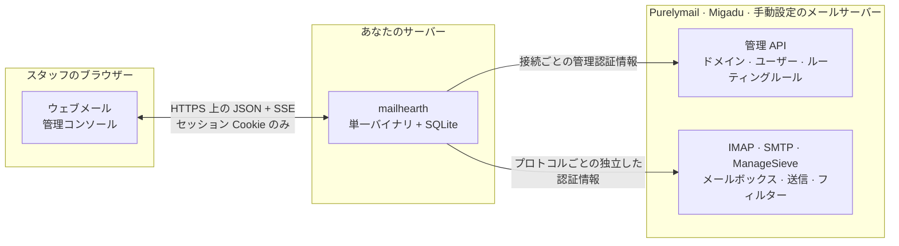

# Mailhearth

[English](README.md) · [简体中文](README.zh-CN.md) · [繁體中文](README.zh-TW.md) · **日本語** · [Español](README.es.md)

**Mailhearth** は、小規模チーム（1〜50 人）向けのセルフホスト型ビジネスメール基盤です。スタートアップ、一人会社、スタジオ、小規模組織に適しています。Purelymail、Migadu、手動設定の IMAP/SMTP メールボックスを接続し、メンバー、ロール、個人・共有メールボックス、エイリアス、グループ、ドメインとウェブメールを提供します。

メールサーバーが配信、フィルタリング、メール保存を担当し、Mailhearth が組織、権限、管理とユーザー体験を提供します。管理 API 認証とメールボックスの各プロトコル認証は独立して設定します。


```mermaid
flowchart LR
    subgraph browser["スタッフのブラウザー"]
        SPA["ウェブメール<br/>管理コンソール"]
    end
    subgraph host["あなたのサーバー"]
        APP["mailhearth<br/>単一バイナリ + SQLite"]
    end
    subgraph pm["Purelymail · Migadu · 手動設定のメールサーバー"]
        API["管理 API<br/>ドメイン · ユーザー · ルーティングルール"]
        MAIL["IMAP · SMTP · ManageSieve<br/>メールボックス · 送信 · フィルター"]
    end

    SPA <-->|"HTTPS 上の JSON + SSE<br/>セッション Cookie のみ"| APP
    APP -->|"接続ごとの管理認証情報"| API
    APP -->|"プロトコルごとの独立した認証情報"| MAIL
```

通常の照会は保存した API やプロトコルのパスワードを返しません。新しい外部クライアント用パスワードには明示的な権限検証と一度限りの取得フローがあります。

| ウェブメール | 管理コンソール |
|---|---|
|  |  |
|  |  |

<sub>ローカルのドキュメント用デモ環境で手動撮影した画像です。デモデータは実際のメールプロバイダーでの検証結果を示すものではありません。</sub>

## できること

**管理者向け**

- 初回設定：組織とメール接続を作成し、リソースを検出して選択した項目を取り込み、認証情報を設定します。メールボックスを関連付けずに完了することもできます。取り込みはリモートの読み取りのみで、ログインには独立した設定が必要です。
- 人を思い浮かべるそのままの形でメンバーを追加できます。氏名、ロール、部署、新規または既存のメールボックス、共有メールボックスへのアクセス、グループ、招待リンク。
- 共有メールボックス（`support@`、`sales@`）は複数人で運用でき、パスワードを見せる必要はありません。アクセスレベル：フル / 送信 / 閲覧。
- エイリアス、転送、キャッチオール、接頭辞付きアドレス、そしてグループの所属に自動で追従するグループ配信用アドレス。
- 退職処理の各ステップを保存：メールボックスの移管や保持、グループ更新、セッション失効。認証情報の処理はプロバイダーの機能に従い、外部失効は管理者の報告を別途記録します。
- DNS の健全性（MX/SPF/DKIM/DMARC）を確認できるドメイン管理と、コピーするだけで使える DNS レコード。
- きめ細かな権限を持つロール、監査ログ、所有権の移譲。

**すべてのユーザー向け**

- 高速で反応のよいウェブメールクライアント：フォルダー、ページング、サーバー側検索、フラグ、一括操作、添付ファイル、自動保存される下書き、署名と複数の送信アイデンティティ、IMAP IDLE によるデスクトップ通知、キーボードショートカット、ライトモードとダークモード、5 言語のインターフェース。
- 共有メールボックスでのチーム作業：誰が返信したかの確認、メッセージの担当割り当て、解決済みにする操作、社内メモの記入。
- ManageSieve が設定済みで必要な拡張機能を備えたサーバーではルールと自動返信を利用できます。既存スクリプトを保持し、有効なスクリプトの引き継ぎには確認が必要です。
- 送信リクエストは SMTP と Sent コピーの結果を個別保存します。配信結果が不明な場合は自動再送せず、Sent 保存の再試行では SMTP を再送信しません。

**セキュリティ体制**

- 管理 API 認証情報とプロトコルのパスワードは AES-256-GCM で暗号化し、鍵はマスターキーから導出します。ブラウザーはセッション Cookie を保持します。権限を持つ管理者は期限内に新しい外部クライアント用パスワードを一度だけ取得できます。
- メッセージの HTML はサーバー側で無害化され、厳格な CSP の下、スクリプトを実行できないサンドボックス iframe で描画されます。リモート画像はあなたが表示を求めるまでブロックされます。添付ファイルは `nosniff` とダウンロード指定付きで配信されます。
- CSRF 対策、ログイン試行回数の制限、argon2id によるパスワードハッシュ、監査証跡。

## 動作要件

- API 管理用の Purelymail または Migadu アカウント、または手動接続用の既存メールボックスと IMAP/SMTP 認証情報。ManageSieve は任意です。
- 小さな Linux ホスト（512 MB のメモリで十分です。バイナリのアイドル時使用量は約 30 MB）と、TLS を終端するリバースプロキシ（Caddy、nginx、Traefik）。

## 実行する

```bash
git clone https://github.com/yll682/Mailhearth.git && cd Mailhearth
cp .env.example .env            # MAILHEARTH_BASE_URL に公開 URL を設定します
docker compose up -d --build
```

URL を開き、組織と接続を設定してリソースを選択します。利用前に有効な各プロトコルの認証情報を設定・検証してください。`/data` ボリュームをバックアップしてください。SQLite データベースと `master.key` が入っています。

Docker を使わない場合、`make build` がウェブクライアントを内蔵した静的バイナリ `mailhearth` を生成します。`MAILHEARTH_DATA_DIR=/var/lib/mailhearth` を付けて実行してください。

## 既存の IMAP/SMTP メールボックスを使う

手動接続を選び、完全なメールアドレスと各プロトコルの hostname、port、TLS mode、username、password を登録します。IMAP と SMTP は別の認証情報を使用できます。ManageSieve がない場合は無効化します。TLS 証明書はシステムの証明書または明示的に設定したプライベート CA 証明書セットで検証します。

転送の取り込みでは転送元、各宛先の確認状態とリモート参照を保持します。未検証の配信方式は `unverified` のままです。Migadu の転送書き込みには V03 の配信検証が必要です。

## 設定

設定はすべて環境変数です。[`.env.example`](.env.example) を参照してください。通常設定するのは `MAILHEARTH_BASE_URL` と `MAILHEARTH_TRUST_PROXY` だけです。

## ドキュメント

- [アーキテクチャ](docs/architecture.ja.md)：コンポーネント、データモデル、メール接続、プロトコル endpoint、永続化された操作の管理。
- [セキュリティ](docs/security.ja.md)：脅威モデルと実施済みの対策。
- [運用](docs/operations.ja.md)：バックアップ、アップグレード、サイジング、トラブルシューティング。
- [結合テスト](docs/integration-testing.ja.md)：実際の Purelymail、Migadu と手動プロトコル環境の検証。
- [変更履歴](CHANGELOG.ja.md)：各リリースでの変更点。

## 開発

```bash
go test ./... -run '^$'
go test -count=1 ./... -run '^TestMultiProvider'
go vet ./...
npm --prefix web run typecheck
npm --prefix web run test
npm --prefix web run build
cd web && npm run dev           # /api を :8080 にプロキシする Vite 開発サーバー
```

Go 1.27、Preact + Vite、SQLite（純粋な Go ドライバー、cgo なし）。すべてが 1 つのバイナリに収まります。

インターフェースは英語、簡体字中国語、繁体字中国語（台湾）、日本語、スペイン語で提供されます。文言は [`web/src/lib/i18n.ts`](web/src/lib/i18n.ts) にあります。英語が原本で、新しい言語の追加は 1 つの辞書と、言語切り替えへの 1 項目の追加で済みます。`web/tests/i18n.test.mjs` が翻訳の網羅性と補間パラメーターを検証します。実際のプロバイダーでの受け入れ検証は未完了で、ローカル検証は外部配信を確認しません。

## ライセンス

MIT です。全文は [LICENSE](LICENSE) にあります。
