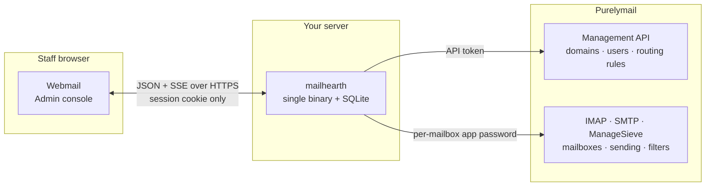
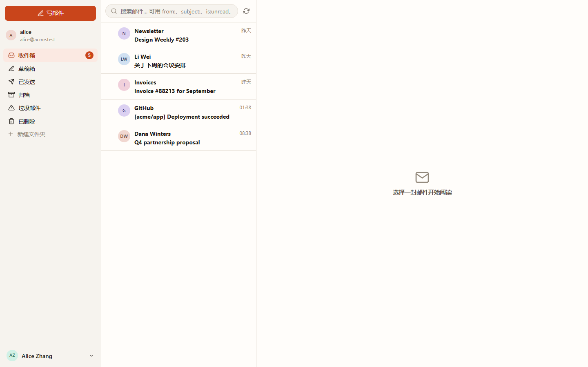
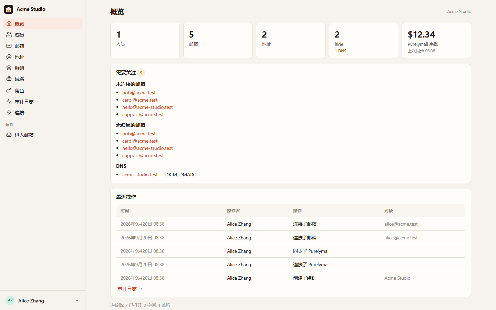
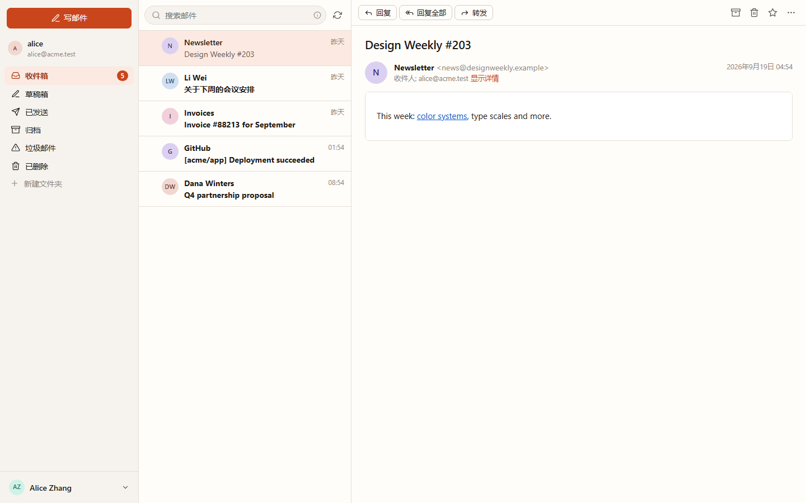
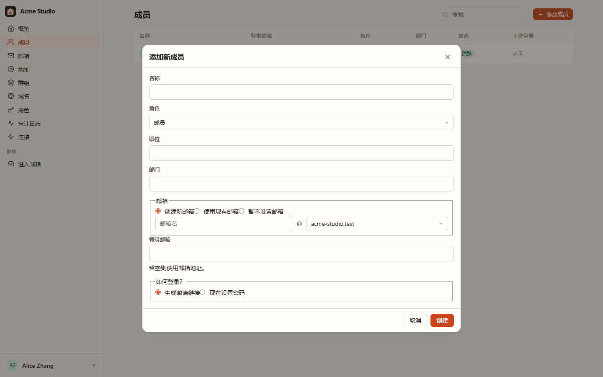

# Mailhearth

**English** · [简体中文](README.zh-CN.md)

**Mailhearth** is a self-hosted business email platform for small teams
(1–50 people): startups, one-person companies, studios and small
organisations. It turns a [Purelymail](https://purelymail.com) account into a
complete team mail product: an organisation with people, roles, personal and
shared mailboxes, aliases, groups and domains, plus a fast webmail client that
staff use every day without ever hearing the word "Purelymail".

Purelymail does the mail: SMTP, delivery, spam filtering, storage, DKIM and
DMARC. Mailhearth does the organisation, permissions, administration and
user experience. Nothing is re-implemented that Purelymail already does well.



Credentials stop at your server: the browser never receives the API token or
any mailbox password.

| Webmail | Admin console |
|---|---|
|  |  |
|  |  |

<sub>Screenshots are produced by `node scripts/screenshot.mjs`, which drives the
real UI against the development stack.</sub>

## What you get

**For administrators**

- First-run wizard: create the organisation, paste a Purelymail API token,
  and import every existing domain, mailbox and routing rule without touching
  the account.
- Onboard people the way you think about them: name, role, department, a new
  or existing mailbox, shared mailbox access, groups, an invite link.
- Shared mailboxes (`support@`, `sales@`) that several people work from
  without ever seeing a password. Access levels: full / send / read.
- Aliases, forwards, catch-all and prefix addresses, and group distribution
  addresses that follow group membership automatically.
- Offboarding in one step: hand a mailbox over, convert it to shared, keep it
  or lock it, forward new mail, rotate every credential, leave groups.
- Domains with DNS health (MX/SPF/DKIM/DMARC) and copy-paste DNS records.
- Roles with fine-grained permissions, an audit log, ownership transfer.

**For everyone**

- A quick, responsive webmail client: folders, paging, server-side search,
  flags, bulk actions, attachments, drafts with autosave, signatures and
  multiple sending identities, desktop notifications via IMAP IDLE, keyboard
  shortcuts, light and dark mode, English and Chinese.
- Shared mailbox teamwork: see who replied, assign a message, mark it
  resolved, leave internal notes.
- Mail rules and auto-reply compiled to Sieve and installed on the server, so
  they work even when nobody is logged in.

**Security posture**

- The Purelymail API token and every mailbox app password are encrypted at
  rest (AES-256-GCM, key derived from a master key) and never leave the server.
  Browsers only ever hold a session cookie.
- Message HTML is sanitised server-side and rendered in a sandboxed,
  script-free iframe under a strict CSP; remote images are blocked until you
  ask for them; attachments are served with `nosniff` and download disposition.
- CSRF protection, rate-limited login, argon2id password hashing, audit trail.

## Requirements

- A Purelymail account with at least one custom domain and an API token
  (Purelymail portal → Account → API).
- A small Linux host (512 MB RAM is plenty; the binary idles around 30 MB)
  and a reverse proxy that terminates TLS (Caddy, nginx, Traefik).

## Run it

```bash
git clone https://github.com/yll682/Mailhearth.git && cd Mailhearth
cp .env.example .env            # set MAILHEARTH_BASE_URL to your public URL
docker compose up -d --build
```

Open the URL, create the organisation, connect Purelymail, import, done.
Back up the `/data` volume: it holds the SQLite database and `master.key`.

Without Docker: `make build` produces a static `mailhearth` binary that
embeds the web client. Run it with `MAILHEARTH_DATA_DIR=/var/lib/mailhearth`.

## Try it without a Purelymail account

```bash
make dev        # or: MAILHEARTH_DEV_STACK=1 go run ./cmd/mailhearth -seed-demo
```

This starts an in-process fake of the Purelymail API, an IMAP server and an
SMTP server with demo data. Use API token `dev-token` in the wizard and bind
`alice@acme.test` as your mailbox. Nothing is persisted between restarts.

## Configuration

Everything is an environment variable; see [`.env.example`](.env.example).
The only ones you normally set are `MAILHEARTH_BASE_URL` and
`MAILHEARTH_TRUST_PROXY`.

## Documentation

- [Architecture](docs/architecture.md): components, data model, how Mailhearth
  maps its concepts onto Purelymail.
- [Security](docs/security.md): threat model and the controls in place.
- [Operations](docs/operations.md): backups, upgrades, sizing, troubleshooting.

## Development

```bash
make test                       # go vet + go test + tsc
cd web && npm run dev           # Vite dev server proxying /api to :8080
node scripts/screenshot.mjs     # drive the UI with headless Chrome
```

Go 1.27, Preact + Vite, SQLite (pure Go driver, no cgo). Everything ships in
one binary.

The interface ships in English and Simplified Chinese. Strings live in
[`web/src/lib/i18n.ts`](web/src/lib/i18n.ts): English is the source, and a
new language is one dictionary plus an entry in the language switcher.

## License

MIT
