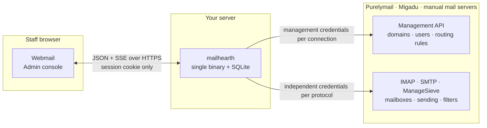
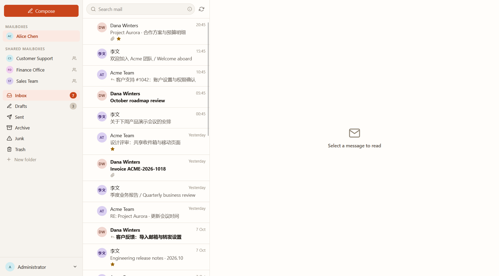
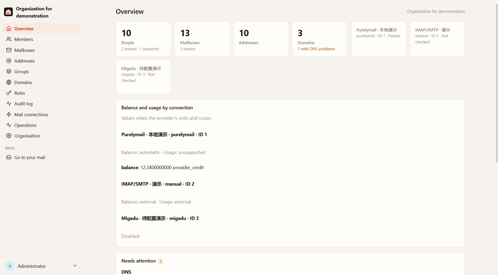
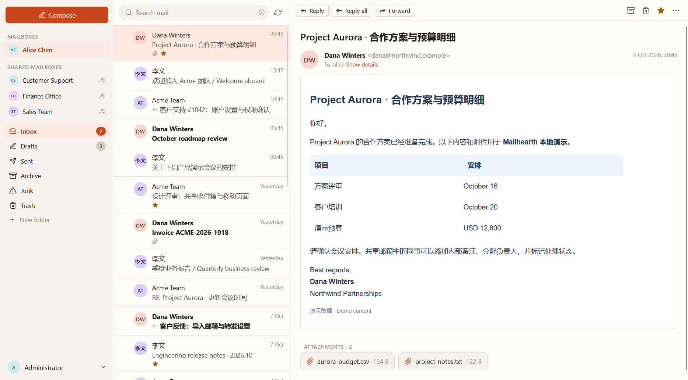
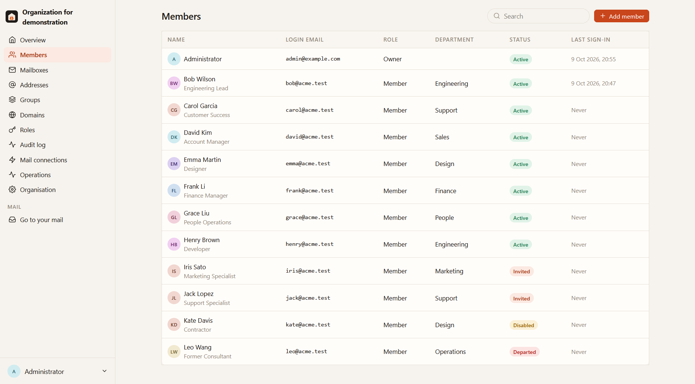

# Mailhearth

**English** · [简体中文](README.zh-CN.md) · [繁體中文](README.zh-TW.md) · [日本語](README.ja.md) · [Español](README.es.md)

**Mailhearth** is a self-hosted business email platform for small teams
(1–50 people): startups, one-person companies, studios and small
organisations. It connects Purelymail, Migadu and manually configured IMAP/SMTP
mailboxes to an organisation with people, roles, personal and shared mailboxes,
aliases, groups and domains, plus a fast webmail client.

Mail servers provide delivery, filtering and message storage. Mailhearth provides
organisation, permissions, administration and the user experience. Management API
authentication and each mailbox's protocol authentication are configured independently.


```mermaid
flowchart LR
    subgraph browser["Staff browser"]
        SPA["Webmail<br/>Admin console"]
    end
    subgraph host["Your server"]
        APP["mailhearth<br/>single binary + SQLite"]
    end
    subgraph pm["Purelymail · Migadu · manual mail servers"]
        API["Management API<br/>domains · users · routing rules"]
        MAIL["IMAP · SMTP · ManageSieve<br/>mailboxes · sending · filters"]
    end

    SPA <-->|"JSON + SSE over HTTPS<br/>session cookie only"| APP
    APP -->|"management credentials per connection"| API
    APP -->|"independent credentials per protocol"| MAIL
```

Routine queries never return saved API or protocol passwords. Newly generated
external-client passwords have an explicit, authorized one-time claim flow.

| Webmail | Admin console |
|---|---|
|  |  |
|  |  |

<sub>Captured manually from the local documentation demo. Demo data does not
represent verification against real mail providers.</sub>

## What you get

**For administrators**

- First-run wizard: create the organisation and mail connections, discover and
  select resources to import, then configure mailbox credentials or complete setup
  without binding a mailbox. Import is read-only upstream and does not enable login.
- Onboard people the way you think about them: name, role, department, a new
  or existing mailbox, shared mailbox access, groups, an invite link.
- Shared mailboxes (`support@`, `sales@`) that several people work from
  without ever seeing a password. Access levels: full / send / read.
- Aliases, forwards, catch-all and prefix addresses, and group distribution
  addresses that follow group membership automatically.
- Persistent offboarding steps: transfer or retain mailboxes, update groups and
  revoke sessions. Protocol credential handling follows the provider's capabilities;
  external revocation requires an administrator report and remains separately recorded.
- Domains with DNS health (MX/SPF/DKIM/DMARC) and copy-paste DNS records.
- Roles with fine-grained permissions, an audit log, ownership transfer.

**For everyone**

- A quick, responsive webmail client: folders, paging, server-side search,
  flags, bulk actions, attachments, drafts with autosave, signatures and
  multiple sending identities, desktop notifications via IMAP IDLE, keyboard
  shortcuts, light and dark mode, and a five-language interface.
- Shared mailbox teamwork: see who replied, assign a message, mark it
  resolved, leave internal notes.
- Mail rules and auto-reply on servers with configured ManageSieve and the required
  extensions. Existing scripts are retained; taking over an active script requires confirmation.
- Sending requests persist SMTP and Sent-copy results separately. Unknown delivery
  is never retried automatically; retrying a failed Sent copy does not submit SMTP again.

**Security posture**

- Management API credentials and mailbox protocol passwords are encrypted at
  rest (AES-256-GCM, key derived from a master key) and never leave the server.
  Browsers hold a session cookie. An authorized administrator can explicitly claim
  a newly generated external-client password once, within its expiry period.
- Message HTML is sanitised server-side and rendered in a sandboxed,
  script-free iframe under a strict CSP; remote images are blocked until you
  ask for them; attachments are served with `nosniff` and download disposition.
- CSRF protection, rate-limited login, argon2id password hashing, audit trail.

## Requirements

- A Purelymail or Migadu account for API management, or an existing mailbox with
  IMAP/SMTP credentials for a manual connection. ManageSieve is optional.
- A small Linux host (512 MB RAM is plenty; the binary idles around 30 MB)
  and a reverse proxy that terminates TLS (Caddy, nginx, Traefik).

## Run it

```bash
git clone https://github.com/yll682/Mailhearth.git && cd Mailhearth
cp .env.example .env            # set MAILHEARTH_BASE_URL to your public URL
docker compose up -d --build
```

Open the URL, create the organisation, configure connections and select imports.
Configure and verify credentials for each enabled mailbox protocol before using mail.
Back up the `/data` volume: it holds the SQLite database and `master.key`.

Without Docker: `make build` produces a static `mailhearth` binary that
embeds the web client. Run it with `MAILHEARTH_DATA_DIR=/var/lib/mailhearth`.

## Use an existing IMAP/SMTP mailbox

Choose a manual connection, register the full mailbox address, and configure each
enabled protocol's hostname, port, TLS mode, username and password. IMAP and SMTP
may use different credentials. Disable ManageSieve when unavailable. TLS certificate
validation uses system certificates or an explicitly configured private CA bundle.

Forwarding imports preserve the source mailbox, individual target confirmation
states and remote references. Unverified delivery modes stay `unverified`;
Migadu forwarding writes require V03 delivery verification.

## Configuration

Everything is an environment variable; see [`.env.example`](.env.example).
The only ones you normally set are `MAILHEARTH_BASE_URL` and
`MAILHEARTH_TRUST_PROXY`.

## Documentation

- [Architecture](docs/architecture.md): components, data model, how Mailhearth
  manages connections, protocol endpoints and persistent operations.
- [Security](docs/security.md): threat model and the controls in place.
- [Operations](docs/operations.md): backups, upgrades, sizing, troubleshooting.
- [Integration testing](docs/integration-testing.md): verifying a release
  against real Purelymail, Migadu and manual protocol environments.
- [Changelog](CHANGELOG.md): what changed in every release.

## Development

```bash
go test ./... -run '^$'
go test -count=1 ./... -run '^TestMultiProvider'
go vet ./...
npm --prefix web run typecheck
npm --prefix web run test
npm --prefix web run build
cd web && npm run dev           # Vite dev server proxying /api to :8080
```

Go 1.27, Preact + Vite, SQLite (pure Go driver, no cgo). Everything ships in
one binary.

The interface ships in English, Simplified Chinese, Traditional Chinese
(Taiwan), Japanese and Spanish. Strings live in
[`web/src/lib/i18n.ts`](web/src/lib/i18n.ts): English is the source, and a
new language is one dictionary plus an entry in the language switcher.
Translation coverage and interpolation parameters are checked by `web/tests/i18n.test.mjs`.
Real-provider acceptance is pending; local checks do not confirm external delivery.

## License

MIT. The full text is in [LICENSE](LICENSE).
