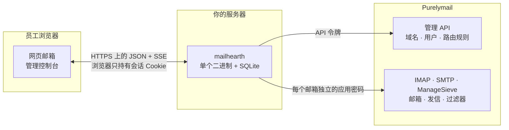
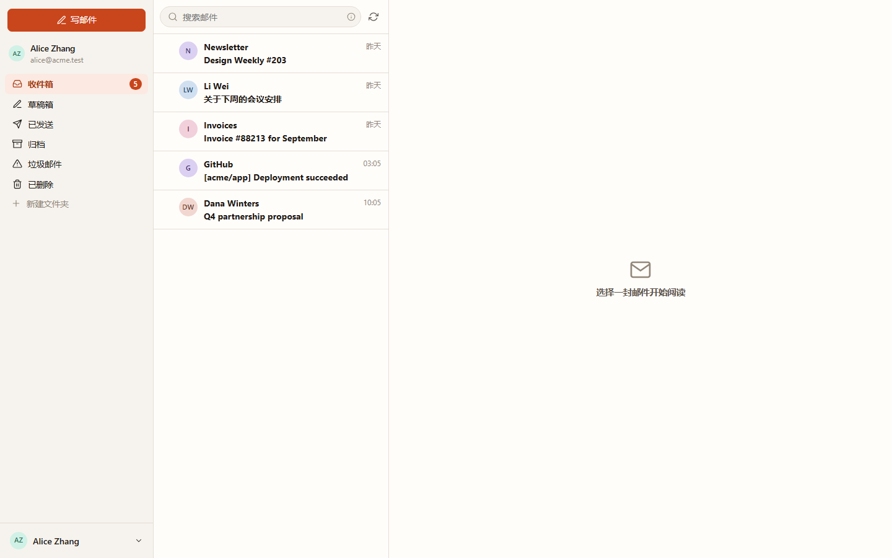
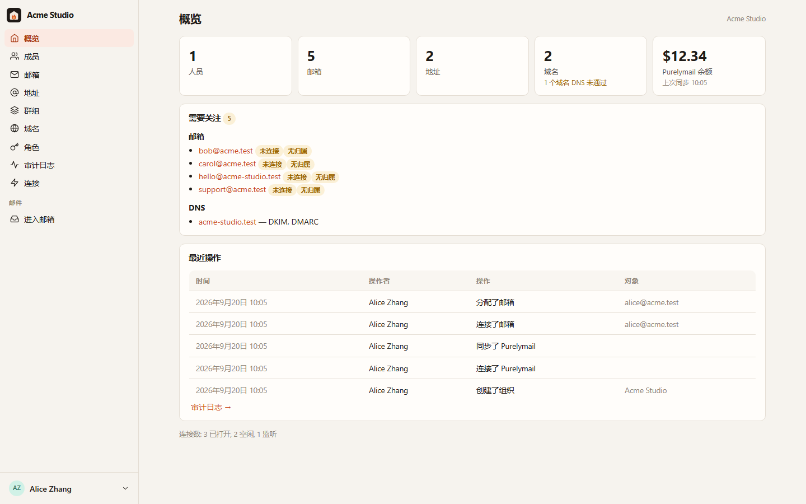
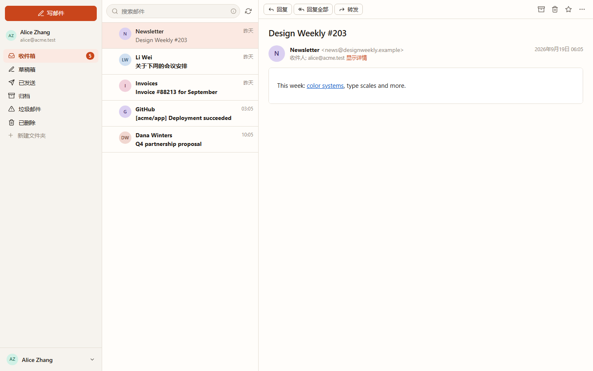
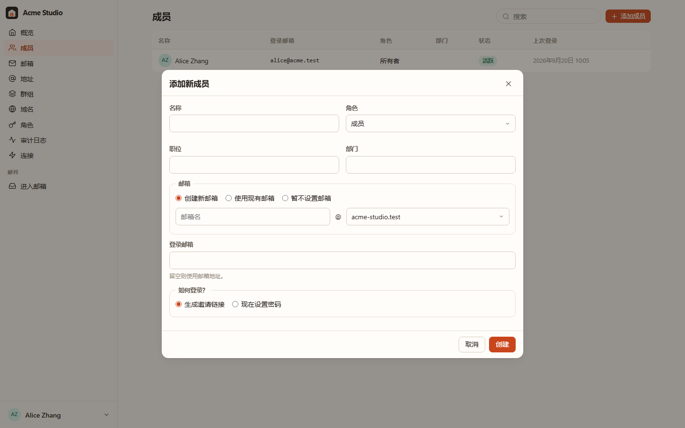

# Mailhearth

[English](README.md) · **简体中文**

**Mailhearth** 是面向小团队（1–50 人）的自托管商务邮箱平台，适合初创公司、一人
公司、工作室和小型组织。它把一个 [Purelymail](https://purelymail.com) 账户变成
完整的团队邮件产品：有成员、角色、个人邮箱和共享邮箱、别名、群组和域名的组织，
以及一个员工每天都在用、却从不需要知道「Purelymail」这个词的快速网页邮箱。

Purelymail 负责邮件本身：SMTP、投递、反垃圾、存储、DKIM 和 DMARC。Mailhearth
负责组织、权限、管理和使用体验。凡是 Purelymail 已经做得好的，一律不重复实现。



凭据止步于你的服务器：浏览器拿不到 API 令牌，也拿不到任何邮箱密码。

| 网页邮箱 | 管理控制台 |
|---|---|
|  |  |
|  |  |

<sub>截图由 `node scripts/screenshot.mjs <地址> <输出目录> zh-CN` 生成，脚本驱动
真实界面在开发环境上运行。</sub>

## 你会得到什么

**对管理员**

- 首次运行向导：创建组织、填入 Purelymail API 令牌，然后把现有的域名、邮箱和
  路由规则全部导入，不改动账户里的任何东西。
- 按「人」的方式添加成员：姓名、角色、部门、新建或绑定已有邮箱、共享邮箱权限、
  群组、邀请链接。
- 共享邮箱（`support@`、`sales@`）可供多人协作，成员始终看不到密码。权限分为
  完全访问 / 可读可发 / 只读。
- 别名、转发、全收（catch-all）和前缀地址，以及自动跟随群组成员变化的分发地址。
- 一步完成离职交接：移交邮箱、转为共享、保留或锁定、转发新邮件、轮换全部凭据、
  退出群组。
- 域名管理，含 DNS 健康状态（MX/SPF/DKIM/DMARC）和可直接复制的 DNS 记录。
- 细粒度权限的角色、审计日志、所有权转让。

**对所有人**

- 快速、响应式的网页邮箱：文件夹、分页、服务端搜索、星标、批量操作、附件、
  自动保存的草稿、签名与多发件身份、基于 IMAP IDLE 的桌面通知、键盘快捷键、
  浅色与深色模式、中英文界面。
- 共享邮箱协作：看到谁已回复、把邮件分配给某人、标记为已处理、留内部备注。
- 邮件规则和自动回复会编译成 Sieve 并安装到服务器，即使没人登录也照常生效。

**安全设计**

- Purelymail API 令牌和每个邮箱的应用密码都加密存储（AES-256-GCM，密钥由主密钥
  派生），绝不离开服务器。浏览器只持有会话 Cookie。
- 邮件 HTML 在服务端消毒，并在严格 CSP 下的无脚本沙箱 iframe 中渲染；远程图片
  默认拦截，由你决定是否显示；附件带 `nosniff` 并强制下载。
- CSRF 防护、登录限流、argon2id 密码哈希、完整审计轨迹。

## 前置条件

- 一个 Purelymail 账户，至少有一个自有域名和一个 API 令牌
  （Purelymail 后台 → Account → API）。
- 一台小型 Linux 主机（512 MB 内存绰绰有余，二进制空载约 30 MB），以及一个负责
  TLS 终止的反向代理（Caddy、nginx、Traefik）。

## 运行

```bash
git clone https://github.com/yll682/Mailhearth.git && cd Mailhearth
cp .env.example .env            # 把 MAILHEARTH_BASE_URL 设成你的公开地址
docker compose up -d --build
```

打开地址，创建组织，连接 Purelymail，导入，完成。请备份 `/data` 卷：SQLite
数据库和 `master.key` 都在里面。

不用 Docker 的话，`make build` 会产出一个内嵌网页客户端的静态 `mailhearth`
二进制，用 `MAILHEARTH_DATA_DIR=/var/lib/mailhearth` 运行即可。

## 没有 Purelymail 账户也能试

```bash
make dev        # 或：MAILHEARTH_DEV_STACK=1 go run ./cmd/mailhearth -seed-demo
```

这会在进程内启动模拟的 Purelymail API、IMAP 服务器和 SMTP 服务器，并带上演示
数据。向导里填 API 令牌 `dev-token`，把 `alice@acme.test` 绑定为你的邮箱。
重启后数据不保留。

## 配置

所有配置都是环境变量，见 [`.env.example`](.env.example)。通常你只需要设置
`MAILHEARTH_BASE_URL` 和 `MAILHEARTH_TRUST_PROXY`。

## 文档

- [架构](docs/architecture.zh-CN.md)：组件、数据模型，以及 Mailhearth 的概念
  如何映射到 Purelymail。
- [安全](docs/security.zh-CN.md)：威胁模型与已实施的防护措施。
- [运维](docs/operations.zh-CN.md)：备份、升级、容量规划、故障排查。
- [集成测试](docs/integration-testing.zh-CN.md)：如何对真实 Purelymail 账户
  跑验证套件。
- [更新日志](CHANGELOG.zh-CN.md)：每个版本改了哪些内容。

## 开发

```bash
make test                       # go vet + go test + tsc
make test-integration           # 对真实 Purelymail 账户跑验证套件
cd web && npm run dev           # Vite 开发服务器，把 /api 代理到 :8080
node scripts/screenshot.mjs http://127.0.0.1:8090 out zh-CN   # 驱动界面
```

Go 1.27、Preact + Vite、SQLite（纯 Go 驱动，无 cgo）。全部打包进一个二进制。

界面提供英文和简体中文。文案在
[`web/src/lib/i18n.ts`](web/src/lib/i18n.ts)：英文是源语言，新增一种语言只需
加一份词典，再在语言切换器里加一项。

## 许可证

MIT，完整文本见 [LICENSE](LICENSE)。
