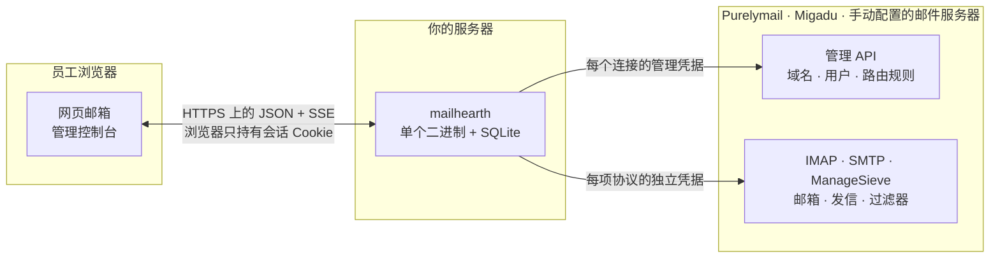
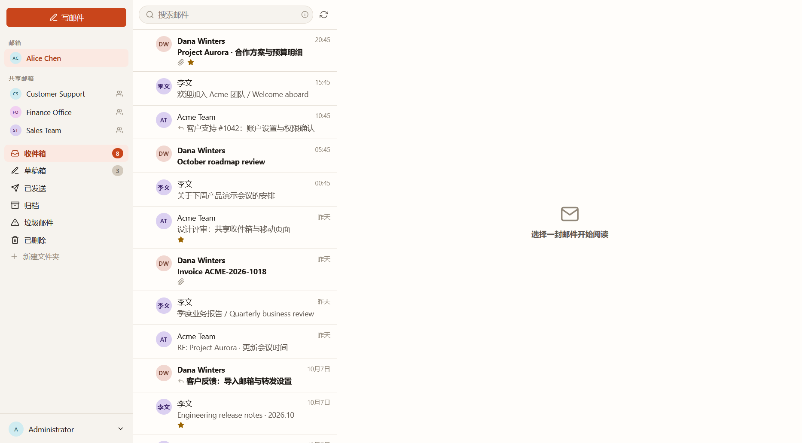
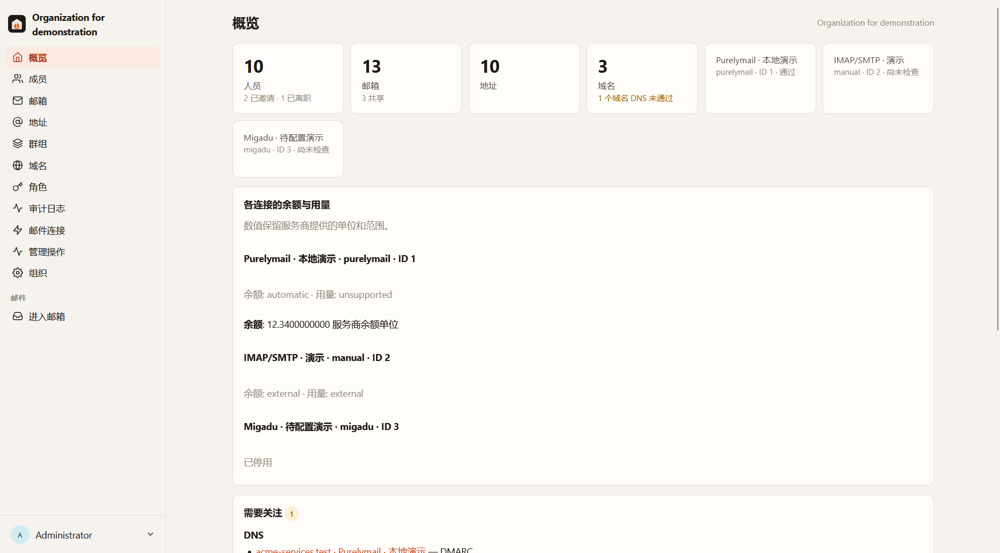
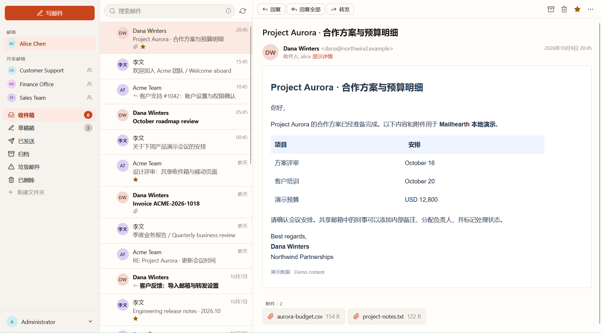
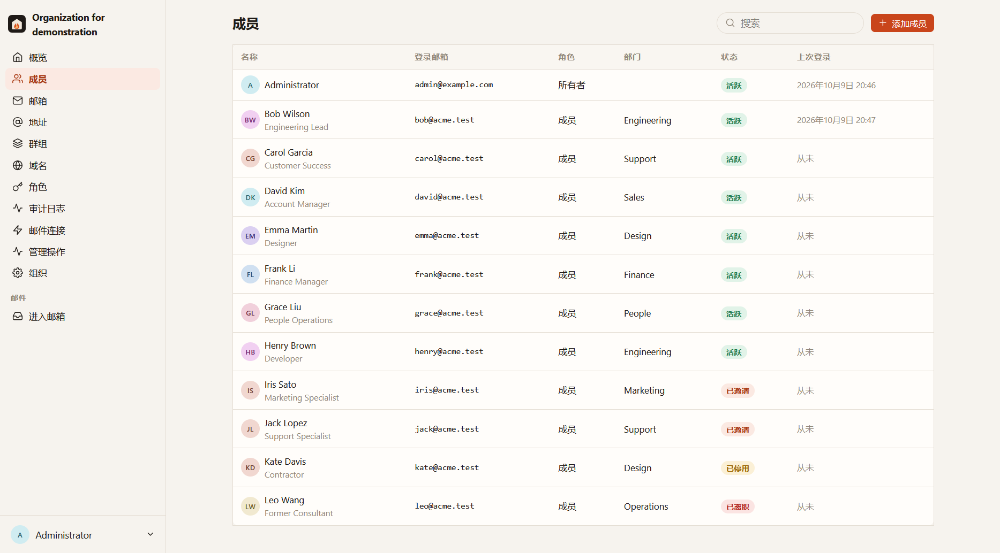

# Mailhearth

[English](README.md) · **简体中文** · [繁體中文](README.zh-TW.md) · [日本語](README.ja.md) · [Español](README.es.md)

**Mailhearth** 是面向小团队（1–50 人）的自托管商务邮箱平台，适合初创公司、一人
公司、工作室和小型组织。它连接 Purelymail、Migadu 和手动配置的 IMAP/SMTP 邮箱，
提供成员、角色、个人邮箱和共享邮箱、别名、群组、域名及网页邮箱。

邮件服务器负责投递、过滤和邮件存储。Mailhearth 负责组织、权限、管理和使用体验。
管理 API 认证与每个邮箱的协议认证分别配置。


```mermaid
flowchart LR
    subgraph browser["员工浏览器"]
        SPA["网页邮箱<br/>管理控制台"]
    end
    subgraph host["你的服务器"]
        APP["mailhearth<br/>单个二进制 + SQLite"]
    end
    subgraph pm["Purelymail · Migadu · 手动配置的邮件服务器"]
        API["管理 API<br/>域名 · 用户 · 路由规则"]
        MAIL["IMAP · SMTP · ManageSieve<br/>邮箱 · 发信 · 过滤器"]
    end

    SPA <-->|"HTTPS 上的 JSON + SSE<br/>浏览器只持有会话 Cookie"| APP
    APP -->|"每个连接的管理凭据"| API
    APP -->|"每项协议的独立凭据"| MAIL
```

常规查询不返回已保存的 API 或协议密码。新生成的外部客户端密码具有明确授权的
一次性领取流程。

| 网页邮箱 | 管理控制台 |
|---|---|
|  |  |
|  |  |

<sub>截图由用户在本地文档演示环境中手动截取。演示数据不代表真实邮件服务商的验证结果。</sub>

## 你会得到什么

**对管理员**

- 首次运行向导：创建组织和邮件连接，发现资源并选择导入，配置邮箱凭据，或者选择
  不绑定邮箱并完成初始化。导入只读取远程资源；邮箱登录需要独立配置。
- 按「人」的方式添加成员：姓名、角色、部门、新建或绑定已有邮箱、共享邮箱权限、
  群组、邀请链接。
- 共享邮箱（`support@`、`sales@`）可供多人协作，成员始终看不到密码。权限分为
  完全访问 / 可读可发 / 只读。
- 别名、转发、全收（catch-all）和前缀地址，以及自动跟随群组成员变化的分发地址。
- 离职交接保存各项步骤：移交或保留邮箱、更新群组、撤销会话。协议凭据处理遵循
  服务商能力；外部撤销需要管理员报告，并单独保存报告状态。
- 域名管理，含 DNS 健康状态（MX/SPF/DKIM/DMARC）和可直接复制的 DNS 记录。
- 细粒度权限的角色、审计日志、所有权转让。

**对所有人**

- 快速、响应式的网页邮箱：文件夹、分页、服务端搜索、星标、批量操作、附件、
  自动保存的草稿、签名与多发件身份、基于 IMAP IDLE 的桌面通知、键盘快捷键、
  浅色与深色模式、五种界面语言。
- 共享邮箱协作：看到谁已回复、把邮件分配给某人、标记为已处理、留内部备注。
- 已配置 ManageSieve 且具备所需扩展的服务器支持邮件规则和自动回复。已有脚本保留，
  接管当前 active script 需要确认。
- 发送请求分别保存 SMTP 和 Sent 副本状态。未知投递结果不会自动重试；重试保存
  Sent 副本不会重新提交 SMTP。

**安全设计**

- 管理 API 凭据和邮箱协议密码加密存储（AES-256-GCM，密钥由主密钥派生）。浏览器
  持有会话 Cookie。授权管理员可以在期限内明确领取一次新生成的外部客户端密码。
- 邮件 HTML 在服务端消毒，并在严格 CSP 下的无脚本沙箱 iframe 中渲染；远程图片
  默认拦截，由你决定是否显示；附件带 `nosniff` 并强制下载。
- CSRF 防护、登录限流、argon2id 密码哈希、完整审计轨迹。

## 前置条件

- 用于 API 管理的 Purelymail 或 Migadu 账户，或者用于手动连接的已有邮箱及
  IMAP/SMTP 凭据。ManageSieve 可以停用。
- 一台小型 Linux 主机（512 MB 内存绰绰有余，二进制空载约 30 MB），以及一个负责
  TLS 终止的反向代理（Caddy、nginx、Traefik）。

## 运行

```bash
git clone https://github.com/yll682/Mailhearth.git && cd Mailhearth
cp .env.example .env            # 把 MAILHEARTH_BASE_URL 设成你的公开地址
docker compose up -d --build
```

打开地址，创建组织，配置连接并选择导入资源。使用邮件之前，请配置并验证每项启用
协议的凭据。请备份 `/data` 卷：SQLite
数据库和 `master.key` 都在里面。

不用 Docker 的话，`make build` 会产出一个内嵌网页客户端的静态 `mailhearth`
二进制，用 `MAILHEARTH_DATA_DIR=/var/lib/mailhearth` 运行即可。

## 使用已有 IMAP/SMTP 邮箱

选择手动连接，登记完整邮箱地址，分别填写各项启用协议的 hostname、port、TLS mode、
username 和 password。IMAP 与 SMTP 可以使用不同凭据；服务器没有 ManageSieve 时
停用该协议。TLS 证书验证使用系统证书或明确配置的私有 CA 证书集合。

转发导入保留来源邮箱、每个目标的确认状态及远程引用。未经验证的投递方式保持
`unverified`；Migadu 转发写入需要通过 V03 投递验证。

## 配置

所有配置都是环境变量，见 [`.env.example`](.env.example)。通常你只需要设置
`MAILHEARTH_BASE_URL` 和 `MAILHEARTH_TRUST_PROXY`。

## 文档

- [架构](docs/architecture.zh-CN.md)：组件、数据模型，以及 Mailhearth 的概念
  如何管理邮件连接、协议 endpoint 和持久化操作。
- [安全](docs/security.zh-CN.md)：威胁模型与已实施的防护措施。
- [运维](docs/operations.zh-CN.md)：备份、升级、容量规划、故障排查。
- [集成测试](docs/integration-testing.zh-CN.md)：真实 Purelymail、Migadu 和
  手动协议环境的验证方法。
- [更新日志](CHANGELOG.zh-CN.md)：每个版本改了哪些内容。

## 开发

```bash
go test ./... -run '^$'
go test -count=1 ./... -run '^TestMultiProvider'
go vet ./...
npm --prefix web run typecheck
npm --prefix web run test
npm --prefix web run build
cd web && npm run dev           # Vite 开发服务器，把 /api 代理到 :8080
```

Go 1.27、Preact + Vite、SQLite（纯 Go 驱动，无 cgo）。全部打包进一个二进制。

界面提供英文、简体中文、繁体中文（台湾）、日语和西班牙语。文案在
[`web/src/lib/i18n.ts`](web/src/lib/i18n.ts)：英文是源语言，新增一种语言只需
加一份词典，再在语言切换器里加一项。
`web/tests/i18n.test.mjs` 检查翻译覆盖和插值参数。真实服务商验收尚未完成，
本地检查没有确认外部投递行为。

## 许可证

MIT，完整文本见 [LICENSE](LICENSE)。
