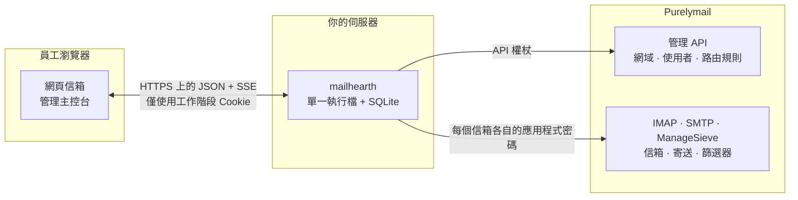
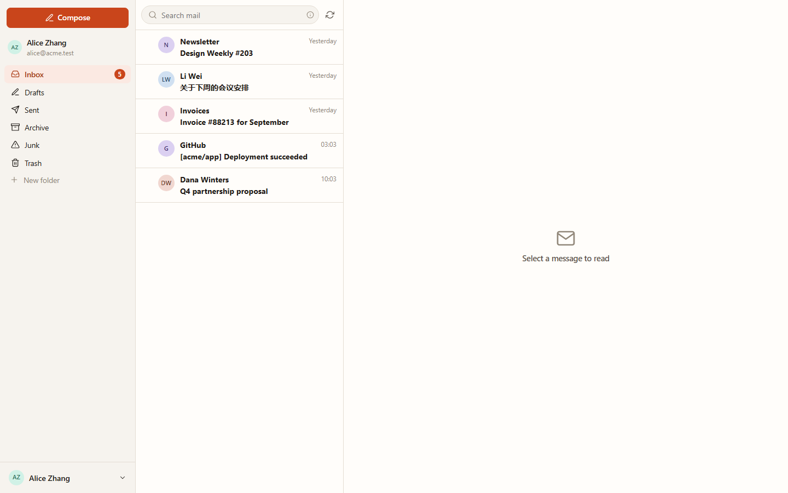
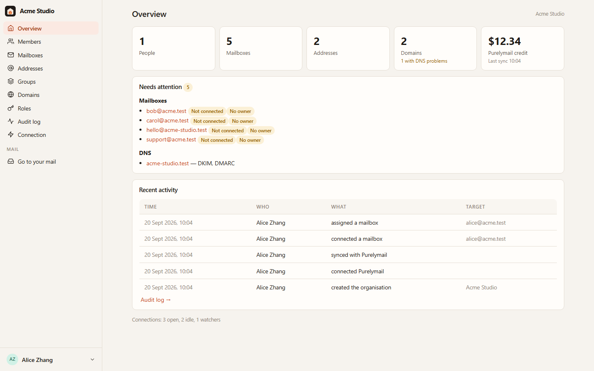
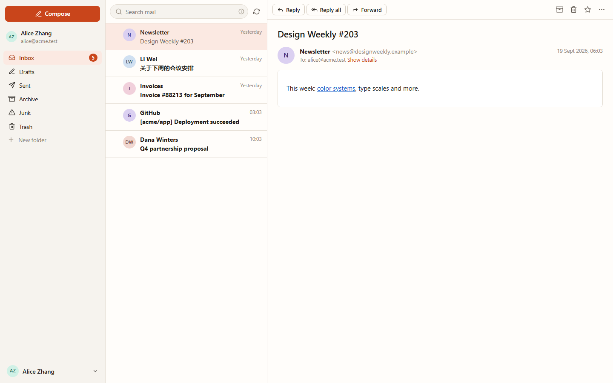
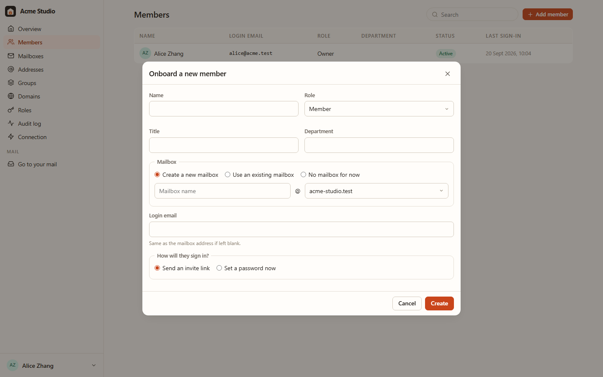

# Mailhearth

[English](README.md) · [简体中文](README.zh-CN.md) · **繁體中文** · [日本語](README.ja.md) · [Español](README.es.md)

**Mailhearth** 是為小型團隊（1–50 人）打造的自架商務電子郵件平台，適合新創
公司、一人公司、工作室和小型組織。它把一個 [Purelymail](https://purelymail.com)
帳戶變成完整的團隊郵件產品：擁有成員、角色、個人與共用信箱、別名、群組和網域
的組織，加上員工每天使用、卻從不需要聽到「Purelymail」這個詞的快速網頁信箱。

Purelymail 負責郵件本身：SMTP、投遞、垃圾郵件篩選、儲存、DKIM 和 DMARC。
Mailhearth 負責組織、權限、管理和使用體驗。凡是 Purelymail 已經做得很好的部分，
一律不重新實作。



憑證只停留在你的伺服器：瀏覽器永遠不會收到 API 權杖，也不會收到任何信箱密碼。

| 網頁信箱 | 管理主控台 |
|---|---|
|  |  |
|  |  |

<sub>由 `node scripts/screenshot.mjs <url> <out-dir> en` 產生，這個指令會驅動真實
介面在開發環境上運作。</sub>

## 你會得到什麼

**給管理員**

- 首次執行精靈：建立組織、貼上 Purelymail API 權杖，然後匯入所有現有的網域、
  信箱和路由規則，完全不更動帳戶內容。
- 依照你思考人的方式加入成員：姓名、角色、部門、新建或沿用既有信箱、共用信箱
  存取權、群組、邀請連結。
- 共用信箱（`support@`、`sales@`）可供多人共同處理，成員始終看不到密碼。
  存取層級：完整 / 寄送 / 讀取。
- 別名、轉寄、全收地址和前綴地址，以及會自動跟隨群組成員變動的群組發信清單地址。
- 一步完成離職處理：移交信箱、轉為共用、保留或鎖定、轉寄新郵件、輪換所有憑證、
  退出群組。
- 網域管理，包含 DNS 健康狀態（MX/SPF/DKIM/DMARC）和可直接複製的 DNS 記錄。
- 具備精細權限的角色、稽核記錄、所有權移轉。

**給所有人**

- 快速且反應靈敏的網頁信箱用戶端：資料夾、分頁、伺服器端搜尋、標記、批次操作、
  附件、自動儲存的草稿、簽名檔與多個寄件身分、透過 IMAP IDLE 的桌面通知、
  鍵盤快速鍵、淺色與深色模式，以及五種語言的介面。
- 共用信箱協作：查看誰已回覆、指派郵件、標記為已解決、留下內部備註。
- 郵件規則和自動回覆會編譯成 Sieve 並安裝到伺服器，因此即使沒有人登入也能
  運作。

**安全態勢**

- Purelymail API 權杖和每個信箱的應用程式密碼都以加密形式儲存（AES-256-GCM，
  金鑰由主金鑰衍生），絕不離開伺服器。瀏覽器只持有工作階段 Cookie。
- 郵件 HTML 在伺服器端消毒，並在嚴格 CSP 下的無指令碼沙箱內嵌框架中呈現；
  遠端圖片在你要求顯示之前一律封鎖；附件以 `nosniff` 和強制下載的方式提供。
- CSRF 防護、登入速率限制、argon2id 密碼雜湊、稽核軌跡。

## 系統需求

- 一個 Purelymail 帳戶，至少有一個自有網域和一個 API 權杖
  （Purelymail 入口網站 → Account → API）。
- 一台小型 Linux 主機（512 MB 記憶體就很充裕，執行檔閒置時約佔 30 MB），以及
  一個負責終止 TLS 的反向代理（Caddy、nginx、Traefik）。

## 執行方式

```bash
git clone https://github.com/yll682/Mailhearth.git && cd Mailhearth
cp .env.example .env            # 將 MAILHEARTH_BASE_URL 設為你的公開網址
docker compose up -d --build
```

開啟網址，建立組織，連接 Purelymail，匯入，完成。請備份 `/data` 磁碟區：
SQLite 資料庫和 `master.key` 都在裡面。

不使用 Docker 時，`make build` 會產生內嵌網頁用戶端的靜態 `mailhearth` 執行檔。
以 `MAILHEARTH_DATA_DIR=/var/lib/mailhearth` 執行即可。

## 沒有 Purelymail 帳戶也能試用

```bash
make dev        # 或：MAILHEARTH_DEV_STACK=1 go run ./cmd/mailhearth -seed-demo
```

這會在同一個行程內啟動 Purelymail API 的模擬服務、IMAP 伺服器和 SMTP 伺服器，
並附帶示範資料。在精靈中使用 API 權杖 `dev-token`，並將 `alice@acme.test` 綁定
為你的信箱。重新啟動後不會保留任何資料。

## 設定

所有設定都是環境變數，請見 [`.env.example`](.env.example)。通常你只需要設定
`MAILHEARTH_BASE_URL` 和 `MAILHEARTH_TRUST_PROXY`。

## 文件

- [架構](docs/architecture.zh-TW.md)：元件、資料模型，以及 Mailhearth 如何將其
  概念對應到 Purelymail。
- [安全性](docs/security.zh-TW.md)：威脅模型與現有的防護措施。
- [營運作業](docs/operations.zh-TW.md)：備份、升級、容量規劃、故障排除。
- [整合測試](docs/integration-testing.zh-TW.md)：如何對真實的 Purelymail 帳戶
  驗證某個版本。
- [變更記錄](CHANGELOG.zh-TW.md)：每個版本有哪些變更。

## 開發

```bash
make test                       # go vet + go test + tsc
make test-integration           # 對真實的 Purelymail 帳戶執行，詳見文件
cd web && npm run dev           # Vite 開發伺服器，將 /api 代理到 :8080
node scripts/screenshot.mjs http://127.0.0.1:8090 out en   # 驅動介面
```

Go 1.27、Preact + Vite、SQLite（純 Go 驅動程式，沒有 cgo）。全部打包在一個
執行檔中。

介面提供英文、簡體中文、繁體中文（台灣）、日文和西班牙文。文案位於
[`web/src/lib/i18n.ts`](web/src/lib/i18n.ts)：英文是來源語言，新增一種語言只需
一份字典，再在語言切換器中加入一個項目。

## 授權條款

MIT。完整條文見 [LICENSE](LICENSE)。
