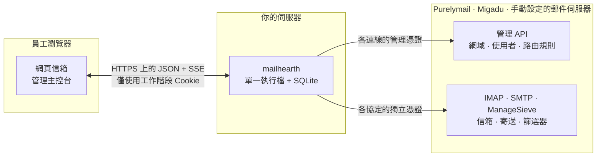

# Mailhearth

[English](README.md) · [简体中文](README.zh-CN.md) · **繁體中文** · [日本語](README.ja.md) · [Español](README.es.md)

**Mailhearth** 是為小型團隊（1–50 人）打造的自架商務電子郵件平台，適合新創公司、一人公司、工作室和小型組織。它連接 Purelymail、Migadu 和手動設定的 IMAP/SMTP 信箱，提供成員、角色、個人與共用信箱、別名、群組、網域及網頁信箱。

郵件伺服器負責投遞、篩選和郵件儲存。Mailhearth 負責組織、權限、管理和使用體驗。管理 API 驗證與各信箱的協定驗證分別設定。


```mermaid
flowchart LR
    subgraph browser["員工瀏覽器"]
        SPA["網頁信箱<br/>管理主控台"]
    end
    subgraph host["你的伺服器"]
        APP["mailhearth<br/>單一執行檔 + SQLite"]
    end
    subgraph pm["Purelymail · Migadu · 手動設定的郵件伺服器"]
        API["管理 API<br/>網域 · 使用者 · 路由規則"]
        MAIL["IMAP · SMTP · ManageSieve<br/>信箱 · 寄送 · 篩選器"]
    end

    SPA <-->|"HTTPS 上的 JSON + SSE<br/>僅使用工作階段 Cookie"| APP
    APP -->|"各連線的管理憑證"| API
    APP -->|"各協定的獨立憑證"| MAIL
```

一般查詢不傳回已保存的 API 或協定密碼。新產生的外部用戶端密碼具有明確授權的一次性領取流程。

| 網頁信箱 | 管理主控台 |
|---|---|
|  |  |
|  |  |

<sub>截圖由使用者在本機文件示範環境中手動擷取。示範資料不代表真實郵件服務商的驗證結果。</sub>

## 你會得到什麼

**給管理員**

- 首次執行精靈：建立組織及郵件連線、探索並選擇匯入資源、設定信箱憑證，或選擇不綁定信箱並完成初始化。匯入僅讀取遠端資源；信箱登入需要獨立設定。
- 依照你思考人的方式加入成員：姓名、角色、部門、新建或沿用既有信箱、共用信箱存取權、群組、邀請連結。
- 共用信箱（`support@`、`sales@`）可供多人共同處理，成員始終看不到密碼。存取層級：完整 / 寄送 / 讀取。
- 別名、轉寄、全收地址和前綴地址，以及會自動跟隨群組成員變動的群組發信清單地址。
- 離職處理保存各項步驟：移交或保留信箱、更新群組、撤銷工作階段。協定憑證處理遵循供應商能力；外部撤銷需要管理員報告，並單獨保存報告狀態。
- 網域管理，包含 DNS 健康狀態（MX/SPF/DKIM/DMARC）和可直接複製的 DNS 記錄。
- 具備精細權限的角色、稽核記錄、所有權移轉。

**給所有人**

- 快速且反應靈敏的網頁信箱用戶端：資料夾、分頁、伺服器端搜尋、標記、批次操作、附件、自動儲存的草稿、簽名檔與多個寄件身分、透過 IMAP IDLE 的桌面通知、鍵盤快速鍵、淺色與深色模式，以及五種語言的介面。
- 共用信箱協作：查看誰已回覆、指派郵件、標記為已解決、留下內部備註。
- 已設定 ManageSieve 且具備所需擴充功能的伺服器支援郵件規則和自動回覆。保留既有指令碼，接管目前 active script 需要確認。
- 寄送請求分別保存 SMTP 與 Sent 副本狀態。未知投遞結果不會自動重試；重試保存 Sent 副本不會重新提交 SMTP。

**安全態勢**

- 管理 API 憑證和信箱協定密碼加密儲存（AES-256-GCM，金鑰由主金鑰衍生）。瀏覽器持有工作階段 Cookie。授權管理員可在期限內明確領取一次新產生的外部用戶端密碼。
- 郵件 HTML 在伺服器端消毒，並在嚴格 CSP 下的無指令碼沙箱內嵌框架中呈現；遠端圖片在你要求顯示之前一律封鎖；附件以 `nosniff` 和強制下載的方式提供。
- CSRF 防護、登入速率限制、argon2id 密碼雜湊、稽核軌跡。

## 系統需求

- 用於 API 管理的 Purelymail 或 Migadu 帳戶，或用於手動連線的既有信箱及 IMAP/SMTP 憑證。ManageSieve 可停用。
- 一台小型 Linux 主機（512 MB 記憶體就很充裕，執行檔閒置時約佔 30 MB），以及一個負責終止 TLS 的反向代理（Caddy、nginx、Traefik）。

## 執行方式

```bash
git clone https://github.com/yll682/Mailhearth.git && cd Mailhearth
cp .env.example .env            # 將 MAILHEARTH_BASE_URL 設為你的公開網址
docker compose up -d --build
```

開啟網址，建立組織，設定連線並選擇匯入資源。使用郵件前，請設定並驗證各項啟用協定的憑證。請備份 `/data` 磁碟區：SQLite 資料庫和 `master.key` 都在裡面。

不使用 Docker 時，`make build` 會產生內嵌網頁用戶端的靜態 `mailhearth` 執行檔。以 `MAILHEARTH_DATA_DIR=/var/lib/mailhearth` 執行即可。

## 使用既有 IMAP/SMTP 信箱

選擇手動連線，登記完整信箱地址，分別填寫啟用協定的 hostname、port、TLS mode、username 和 password。IMAP 與 SMTP 可使用不同憑證；沒有 ManageSieve 時停用該協定。TLS 憑證驗證使用系統憑證或明確設定的私人 CA 憑證集合。

轉寄匯入保留來源信箱、各目標的確認狀態及遠端參照。未驗證的投遞方式保持 `unverified`；Migadu 轉寄寫入需要通過 V03 投遞驗證。

## 設定

所有設定都是環境變數，請見 [`.env.example`](.env.example)。通常你只需要設定 `MAILHEARTH_BASE_URL` 和 `MAILHEARTH_TRUST_PROXY`。

## 文件

- [架構](docs/architecture.zh-TW.md)：元件、資料模型，以及 Mailhearth 如何將其概念對應到郵件連線、協定 endpoint 和持久化操作。
- [安全性](docs/security.zh-TW.md)：威脅模型與現有的防護措施。
- [營運作業](docs/operations.zh-TW.md)：備份、升級、容量規劃、故障排除。
- [整合測試](docs/integration-testing.zh-TW.md)：真實 Purelymail、Migadu 與手動協定環境的驗證方法。
- [變更記錄](CHANGELOG.zh-TW.md)：每個版本有哪些變更。

## 開發

```bash
go test ./... -run '^$'
go test -count=1 ./... -run '^TestMultiProvider'
go vet ./...
npm --prefix web run typecheck
npm --prefix web run test
npm --prefix web run build
cd web && npm run dev           # Vite 開發伺服器，將 /api 代理到 :8080
```

Go 1.27、Preact + Vite、SQLite（純 Go 驅動程式，沒有 cgo）。全部打包在一個執行檔中。

介面提供英文、簡體中文、繁體中文（台灣）、日文和西班牙文。文案位於 [`web/src/lib/i18n.ts`](web/src/lib/i18n.ts)：英文是來源語言，新增一種語言只需一份字典，再在語言切換器中加入一個項目。`web/tests/i18n.test.mjs` 檢查翻譯覆蓋和插值參數。真實供應商驗收尚未完成，本地檢查沒有確認外部投遞行為。

## 授權條款

MIT。完整條文見 [LICENSE](LICENSE)。
